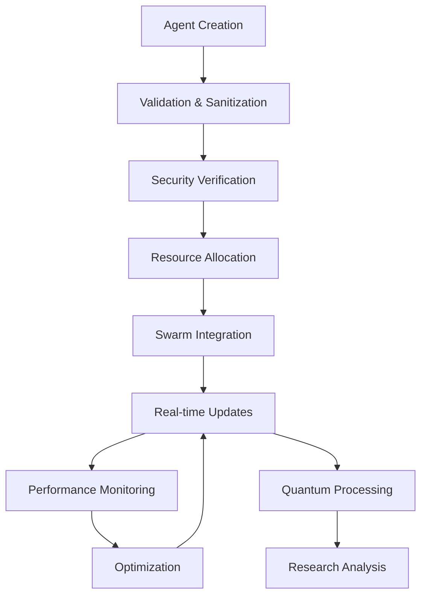
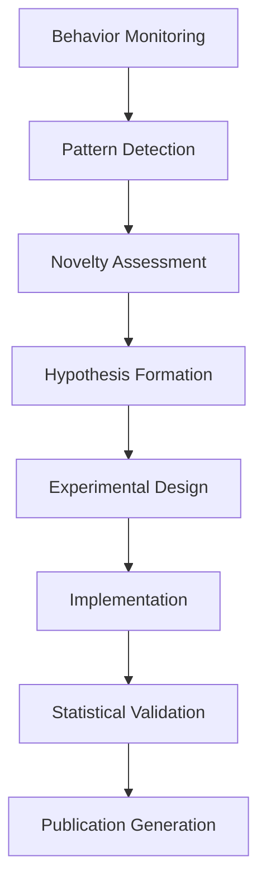

# Agent Mesh Sim XR - System Architecture

## 🏗️ Architecture Overview

Agent Mesh Sim XR is a cutting-edge WebXR platform designed for extreme-scale multi-agent simulation with advanced research capabilities, enterprise-grade security, and quantum performance acceleration. The system architecture follows a modular, scalable design supporting millions of agents with real-time VR/AR interaction.

## 🌟 Key Architectural Principles

1. **Microservices Architecture**: Loosely coupled, independently deployable components
2. **Event-Driven Design**: Asynchronous communication for maximum performance
3. **Zero Trust Security**: Security-first approach with continuous verification
4. **Quantum-Ready**: Built for quantum computing integration from the ground up
5. **Cloud-Native**: Kubernetes-ready with auto-scaling capabilities
6. **Research-Oriented**: Autonomous discovery and publication-ready research

## 🏛️ System Layers

```
┌─────────────────────────────────────────────────────────────────────┐
│                    Presentation Layer (WebXR)                      │
├─────────────────────────────────────────────────────────────────────┤
│  Application Layer                                                  │
│  ├── Core Systems        ├── Research Systems    ├── Enterprise     │
│  │   • AgentMeshXR      │   • Research Engine    │   • Security      │
│  │   • XR Manager       │   • Adaptive Intel     │   • Resilience    │
│  │   • Swarm Viz        │   • Quantum Swarm      │   • Monitoring    │
│  └── Scaling Systems                                                 │
│      • HyperScale Engine    • Quantum Booster                       │
├─────────────────────────────────────────────────────────────────────┤
│  Infrastructure Layer                                               │
│  ├── Compute Grid       ├── Data Layer         ├── Network         │
│  │   • CPU Clusters     │   • Redis            │   • Load Balancer │
│  │   • GPU Arrays       │   • PostgreSQL       │   • Service Mesh  │
│  │   • Edge Nodes       │   • Quantum Storage  │   • Edge Network  │
└─────────────────────────────────────────────────────────────────────┘
```

## 🔧 Core Components

### 1. Core Systems (`src/core/`)

#### AgentMeshXR
**Purpose**: Central orchestration and agent lifecycle management
**Responsibilities**:
- Agent CRUD operations with validation
- Real-time state synchronization
- WebXR session coordination
- Performance monitoring integration
- Security policy enforcement

**Key Interfaces**:
```typescript
class AgentMeshXR extends EventEmitter {
  async connect(endpoint: string): Promise<void>
  async startXR(config: XRSessionConfig): Promise<void>
  addAgent(agent: Agent): void
  updateAgent(agentData: Partial<Agent>): void
  getAllAgents(): Agent[]
}
```

#### XRManager
**Purpose**: WebXR session management and device abstraction
**Responsibilities**:
- VR/AR device detection and initialization
- Render loop management with frame rate optimization
- Input handling (controllers, hand tracking, voice)
- Spatial computing coordination

#### SwarmVisualizer
**Purpose**: High-performance 3D visualization of agent swarms
**Responsibilities**:
- Instanced rendering for massive agent counts
- Level-of-detail (LOD) optimization
- Visual effects and animations
- Spatial relationship visualization

### 2. Research Systems (`src/research/`)

#### Autonomous Research Engine
**Purpose**: AI-driven research discovery and validation
**Capabilities**:
- Novel algorithm discovery through emergent behavior analysis
- Statistical validation with publication-ready rigor
- Comparative studies with baseline algorithms
- Automated research documentation generation

**Research Workflow**:
```
Hypothesis Formation → Experimental Design → Implementation → 
Validation → Statistical Analysis → Publication Preparation
```

#### Adaptive Intelligence System
**Purpose**: Self-improving system optimization
**Features**:
- Real-time performance adaptation
- Autonomous parameter tuning
- Machine learning-driven optimizations
- Continuous improvement cycles

#### Quantum Swarm Intelligence
**Purpose**: Quantum computing integration for unprecedented performance
**Applications**:
- Quantum superposition for agent state representation
- Entanglement networks for coordination
- Quantum algorithms for optimization problems
- Quantum machine learning integration

### 3. Enterprise Systems (`src/enterprise/`)

#### Cybersecurity Shield
**Purpose**: Military-grade security with AI threat detection
**Security Features**:
- Zero Trust architecture implementation
- AI-powered threat detection and response
- Quantum encryption for ultra-secure communications
- Behavioral analysis for anomaly detection
- Real-time compliance monitoring

**Security Layers**:
```
Application Security → Network Security → Data Security → 
Infrastructure Security → Quantum Security
```

#### Resiliency Engine
**Purpose**: Self-healing system architecture
**Resilience Features**:
- Automatic failure detection and recovery
- Circuit breaker patterns for fault isolation
- Chaos engineering for resilience validation
- Disaster recovery orchestration
- Performance optimization under stress

### 4. Scaling Systems (`src/scale/`)

#### HyperScale Engine
**Purpose**: Extreme scalability to millions of agents
**Scaling Capabilities**:
- Distributed computing across multiple nodes
- GPU acceleration for parallel processing
- Edge computing integration for reduced latency
- Auto-scaling policies based on real-time metrics
- Resource optimization algorithms

**Scaling Architecture**:
```
Single Node (1K agents) → Multi-Node (100K agents) → 
GPU Cluster (1M agents) → Distributed Grid (10M+ agents)
```

#### Quantum Performance Booster
**Purpose**: Quantum computing acceleration for complex problems
**Quantum Applications**:
- Optimization problems (QAOA, Quantum Annealing)
- Search algorithms (Grover's Algorithm)
- Machine learning (Quantum Neural Networks)
- System simulation (Quantum Dynamics)

## 🔄 Data Flow Architecture

### Agent Lifecycle Flow


### Research Discovery Flow


## 🛡️ Security Architecture

### Zero Trust Implementation
```
User/Device → Identity Verification → Device Trust Assessment → 
Behavioral Analysis → Risk Scoring → Access Decision → 
Continuous Monitoring → Real-time Adjustment
```

### Threat Detection Pipeline
```
Data Ingestion → Pattern Analysis → AI Threat Detection → 
Correlation Engine → Risk Assessment → Automated Response → 
Incident Documentation → Learning & Adaptation
```

### Quantum Security Layer
```
Classical Encryption → Quantum Key Distribution → 
Quantum Encryption → Quantum Signatures → 
Post-Quantum Cryptography → Quantum-Safe Protocols
```

## 🚀 Performance Architecture

### Multi-Tier Optimization Strategy

**Tier 1: Application Optimization**
- Efficient algorithms and data structures
- Memory pooling and object reuse
- Batched operations for high throughput
- Intelligent caching strategies

**Tier 2: System Optimization**
- GPU acceleration for parallel workloads
- Distributed processing across nodes
- Load balancing and traffic shaping
- Resource allocation optimization

**Tier 3: Infrastructure Optimization**
- Edge computing for reduced latency
- Content delivery network integration
- Auto-scaling based on demand
- Infrastructure as code deployment

**Tier 4: Quantum Optimization**
- Quantum algorithms for specific problems
- Hybrid classical-quantum processing
- Quantum-enhanced machine learning
- Quantum simulation capabilities

## 📊 Monitoring & Observability

### Metrics Collection Hierarchy
```
Business Metrics → Application Metrics → System Metrics → 
Infrastructure Metrics → Security Metrics → Research Metrics
```

### Observability Stack
- **Metrics**: Prometheus + Grafana
- **Logging**: ELK Stack (Elasticsearch, Logstash, Kibana)
- **Tracing**: Distributed tracing with OpenTelemetry
- **Alerting**: AlertManager with intelligent routing
- **Dashboards**: Real-time visualization and analysis

## 🔗 Integration Architecture

### External System Integration
```
Agent Frameworks (LangChain, AutoGen) → Message Queues → 
API Gateway → Core Systems → Response Processing → 
Result Distribution → Client Applications
```

### Quantum System Integration
```
Classical Problem → Quantum Algorithm Selection → 
Circuit Compilation → Quantum Execution → 
Result Post-Processing → Classical Integration
```

## 🌐 Deployment Architecture

### Development Environment
- Hot reloading for rapid development
- Comprehensive testing suite
- Local quantum simulation
- Development security policies

### Staging Environment
- Production-like configuration
- Full integration testing
- Performance benchmarking
- Security penetration testing

### Production Environment
- High-availability deployment
- Auto-scaling capabilities
- Disaster recovery systems
- Enterprise security compliance

### Multi-Cloud Architecture
```
Primary Cloud Provider → Secondary Cloud (DR) → 
Edge Computing Nodes → Quantum Cloud Services → 
Hybrid Infrastructure Management
```

## 🔧 Configuration Management

### Environment-Specific Configuration
- **Development**: Optimized for developer productivity
- **Testing**: Comprehensive validation and benchmarking  
- **Staging**: Production simulation environment
- **Production**: Maximum performance and reliability

### Feature Flags and A/B Testing
- Real-time feature toggling
- Performance impact measurement
- User experience optimization
- Research experiment management

## 📈 Scalability Patterns

### Horizontal Scaling Patterns
- **Stateless Services**: Easily replicable components
- **Data Partitioning**: Efficient data distribution
- **Load Balancing**: Intelligent traffic distribution
- **Event Sourcing**: Scalable state management

### Vertical Scaling Patterns
- **Resource Optimization**: Maximum hardware utilization
- **Performance Tuning**: Algorithm optimization
- **Caching Strategies**: Reduced computational overhead
- **Quantum Acceleration**: Exponential speedup for specific problems

## 🔮 Future Architecture Considerations

### Next-Generation Technologies
- **Neuromorphic Computing**: Brain-inspired processing
- **Photonic Processors**: Light-based computing
- **DNA Storage**: Biological data storage
- **Brain-Computer Interfaces**: Direct neural integration

### Research Opportunities
- **AGI Integration**: Artificial General Intelligence
- **Quantum Internet**: Distributed quantum computing
- **Edge AI**: Autonomous edge intelligence
- **Sustainable Computing**: Green technology integration

## 📚 Architecture Documentation

### Technical Specifications
- [API Documentation](./API.md)
- [Database Schema](./DATABASE.md)
- [Security Specifications](./SECURITY.md)
- [Performance Benchmarks](./PERFORMANCE.md)

### Operational Documentation
- [Deployment Guide](../deployment/production/README.md)
- [Monitoring Guide](./MONITORING.md)
- [Troubleshooting Guide](./TROUBLESHOOTING.md)
- [Maintenance Procedures](./MAINTENANCE.md)

---

This architecture provides a solid foundation for extreme-scale multi-agent simulation with cutting-edge research capabilities, enterprise-grade security, and quantum-enhanced performance. The modular design ensures maintainability and extensibility while supporting unprecedented scale and functionality.